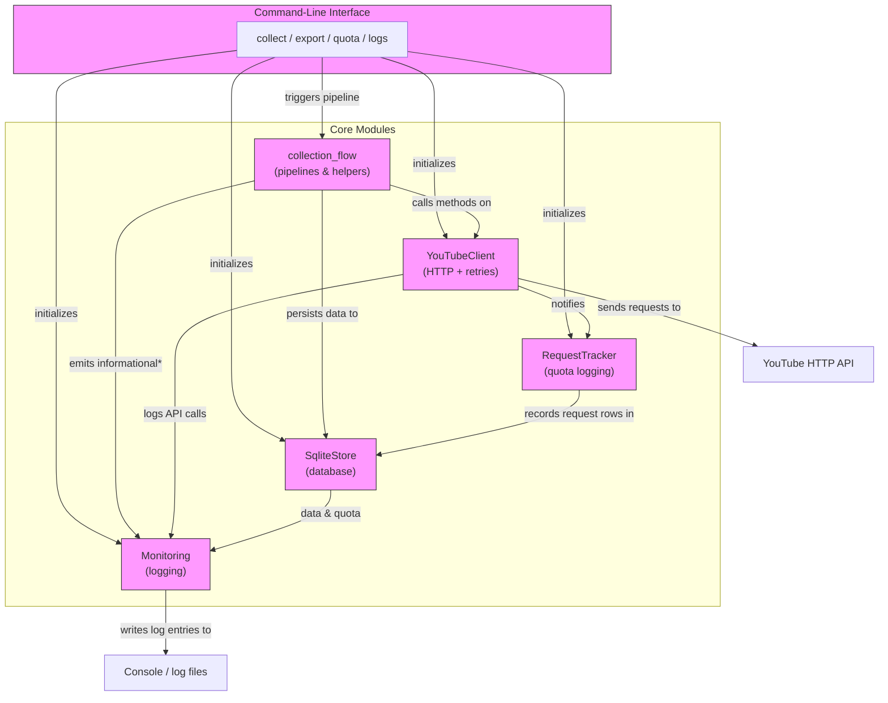

# Architecture Diagram

The following Mermaid diagram gives an overview of the main components in the
YouTube collection application and how they interact during a run.

```mermaid
flowchart TB
    %% high-level components
    subgraph CLI["Command‑Line Interface"]
        CLI_Run["collect / export / quota / logs"]
    end

    subgraph Core["Core Modules"]
        CF["collection_flow
(pipelines & helpers)"]
        YTC["YouTubeClient
(HTTP + retries)"]
        STORE["SqliteStore
(database) "]
        TRACK["RequestTracker
(quota logging)"]
        MON["Monitoring
(logging)"]
    end

    External["YouTube HTTP API"]
    Console["Console / log files"]

    CLI_Run -->|initializes| YTC
    CLI_Run -->|initializes| STORE
    CLI_Run -->|initializes| TRACK
    CLI_Run -->|initializes| MON
    CLI_Run -->|triggers pipeline| CF

    CF -->|calls methods on| YTC
    CF -->|persists data to| STORE
    CF -->|emits informational*| MON

    YTC -->|sends requests to| External
    YTC -->|notifies| TRACK
    YTC -->|logs API calls| MON

    TRACK -->|records request rows in| STORE

    STORE -->|data & quota| MON

    MON -->|writes log entries to| Console

    %% styling
    classDef component fill:#f9f,stroke:#333,stroke-width:1px;
    class CLI,CF,YTC,STORE,TRACK,MON component;
```